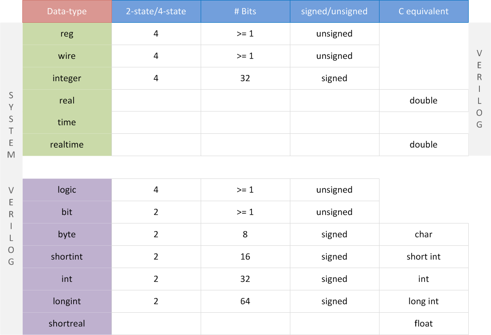

# Data types

数据类型的学习如果仅仅是看书必然是低效的，在学习数据类型的过程中要思考：我什么情况下用这种数据类型？用它的时候要注意点什么？那么在多次实例和查阅中自然而然就能熟练掌握数据类型的知识

数据类型需要关注这些因素：

1. 双态还是四态？实际的线网具有 0，1，X(未知)，Z(高阻)四态，但是为了验证方便往往只需要双态即可
2. 多少比特位？
3. 有符号还是无符号？有无符号也影响了数值的范围

## 数据类型总览

因为 sv 可以作为 verilog 与 c++ 的融合，因此表中数据类型分别作了对照。



## Logic

sv 中最常用的四态变量

logic 变量兼具 verilog 中 reg 和 wire 的功能，使得验证人员能够全都要，但是在多驱动情况下不能使用 logic 而是用 wire。

```c++
//声明 logic 变量
logic [3:0]	example_1;
logic			 example_2;
```

## bit

sv 中最常用的双态变量，对于验证内部变量往往使用双态来提高仿真器性能以及减少内存使用

```c++
//声明 bit 变量
bit [3:0]	example_1;
bit			 example_2;
```

但是双态变量在于设计代码端口连接时，可能会出现将四态值转换为双态值的问题。对于可能出现 X，Y 值的变量可以通过`$isunknown`来进行检查，该操作符会在出现 XY 值时返回 1 。

```c++
//isunknown实例
//在检测出 XY 值时打印仿真时间与端口名
if($isunknown(port_name) == 1)
  $display("@%0t: 4-state value detected on port %b", $time, port_name);
```

## byte

8 位的有符号数，长度正好为一个字节，可以通过`unsigned`声明为无符号数。

在随机化过程中，带符号变量可能会出问题，因此声明 byte 依然可以用 `logic[7:0]`代替

# structures

## enumeration

sv 引入枚举(enumeration)变量用来解决参数定义问题，可以使得参数更具有可读性

枚举变量一经声明不可改变，因此想要重复使用的话可以用`typedef`来声明

```c++
//声明 enumeration 变量
enum [data_type] {name1=value1, name2=value2, nameN=valueN} varname;

typedef enum [ ]{ } varname;
  varname newname;
```


